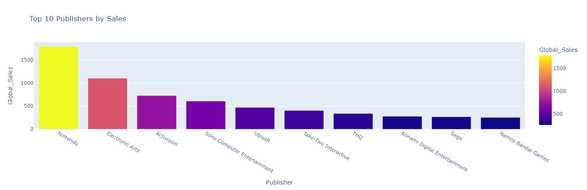
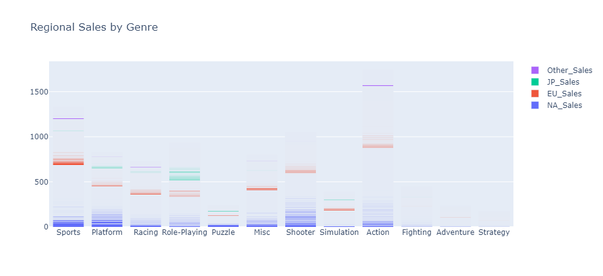
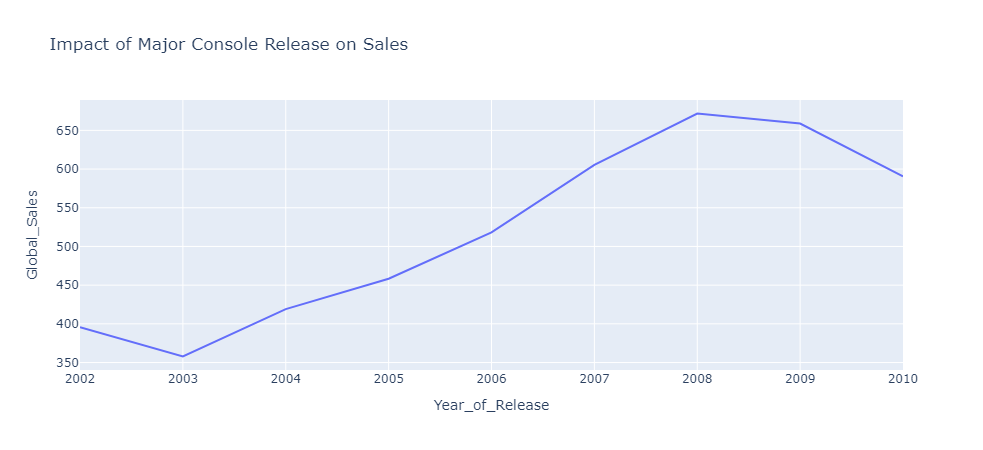
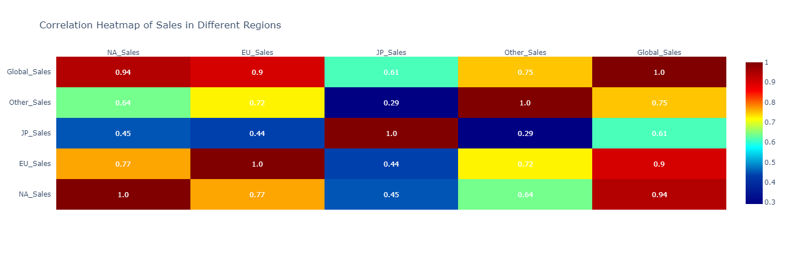
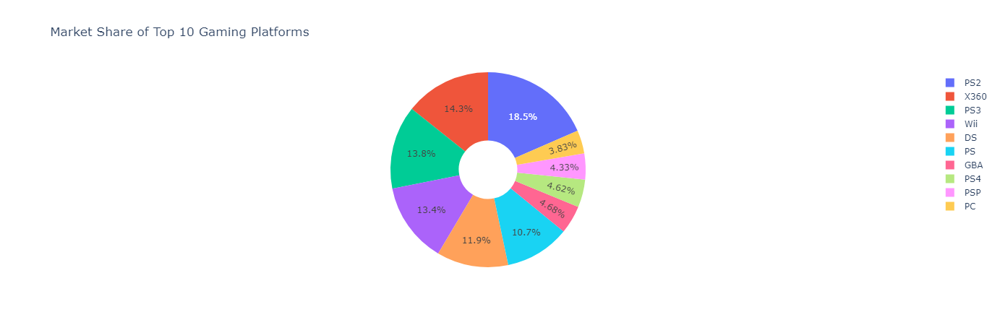
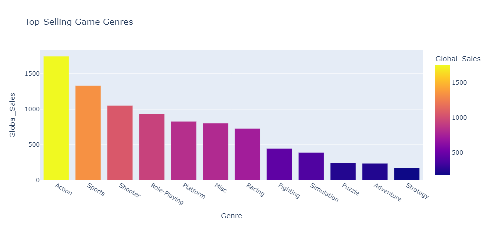

🎮 Exploratory Data Analysis (EDA) on Video Game Sales

📌 Overview

This project performs Exploratory Data Analysis (EDA) on a video game sales dataset, providing insights into sales trends, genre popularity, platform performance, and publisher influence. The goal is to uncover key patterns and market trends that define the gaming industry.

📎 Dataset Information

Dataset Name: Video_Games_Sales_as_at_22_Dec_2016.csv

Source: [Mention source if applicable](https://www.kaggle.com/datasets/gregorut/videogamesales)

Total Records: [16719 X 16]

🌍 Sales Data – Global and regional sales (NA, EU, JP, Other)

🚀 Project Objectives

✅ Clean and preprocess data for accurate analysis✅ Explore global and regional sales trends✅ Analyze the popularity of gaming genres✅ Identify top publishers and platforms✅ Investigate the impact of critic and user ratings on sales✅ Visualize findings using interactive Plotly charts

🔍 Key Insights from the Analysis

📌 **1. Top 10 Publishers by Sales**

The leading publishers in the gaming industry were identified based on total global sales.

Some publishers dominate the market, releasing multiple high-grossing titles.

📊 Visualization: Bar chart of total sales per publisher

📌 **2. Regional Sales by Genre**

Different regions have unique gaming preferences.

Some genres sell well in North America but underperform in Japan.

📊 Visualization: Stacked bar chart showing regional sales distribution

📌 **3. Video Game Sales Trend Over the Years**

Video game sales peaked in certain years due to console launches and hit titles.

Industry downturns and shifts in gaming preferences are evident in later years.

📊 Visualization: Line chart of yearly sales trends

📌 **4. Heat Map of Sales by Genre and Region**

Identifies strongest markets for different genres.

Reveals which regions drive the highest sales for each game type.

📊 Visualization: Heatmap of sales distribution by genre and region

📌 **5. Sales Performance by Platform**

Some gaming platforms dominate the industry in total sales.

Older platforms still retain market presence, while some fade out over time.

📊 Visualization: Bar chart of total sales per platform

📌 **6. Top-Selling Video Games**

A handful of games achieved record-breaking sales.

The presence of franchises (e.g., Pokémon, Mario, Call of Duty) is significant.

📊 Visualization: Bar chart of highest-selling games

📌 **7. Genre Popularity Over Time**

Shows evolution of gaming preferences over decades.

New genres emerge while some decline in popularity.

📊 Visualization: Line chart of yearly sales per genre

📌 **8. Publisher Market Share**

Compares the market share of top publishers over time.

Some publishers maintain long-term dominance, while others fluctuate.

📊 Visualization: Pie chart of publisher market share

📊 Visualizations Used

The project extensively uses interactive Plotly charts to present insights, including:✅ Bar Charts – For total sales by publisher, genre, platform✅ Line Charts – For yearly trends, genre popularity over time✅ Heatmaps – For region-wise sales distribution✅ Pie Charts – For publisher market share✅ Scatter Plots – For correlation between ratings and sales

⚙ Technology Stack

✅ Python – Main programming language

✅ Pandas – Data cleaning and manipulation

✅ Plotly – Interactive visualizations

✅ Jupyter Notebook – Development environment

#### How to Run the Project

    1️⃣ Install Dependencies

pip install pandas plotly jupyter

    2️⃣ Clone Repository & Load Data

git clone [https://github.com/your-username/video-game-eda.git](https://github.com/Jayant-Gautam/VideoGameAnalysis-EDA-.git)

    cd video-game-eda

    jupyter notebook

    3️⃣ Run Jupyter Notebook

Open the EDA notebook and execute the cells to generate insights.

The dataset is preloaded, and all visualizations will be displayed.

🌟 Conclusion

This EDA project provides valuable insights into the video game industry, exploring key trends, sales performance, and genre popularity. These findings can help game developers, publishers, and marketers make informed business decisions.

📌 This project is optimized to be included in a resume-level portfolio for data science roles at companies like Microsoft! 🚀
